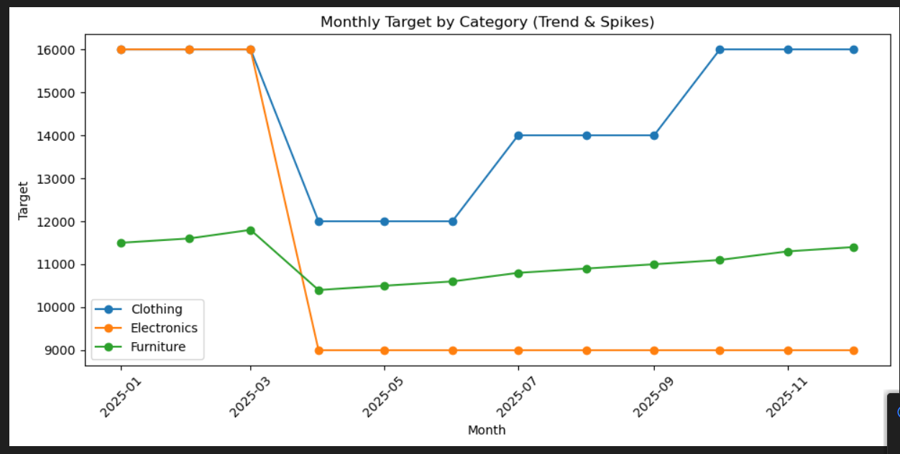
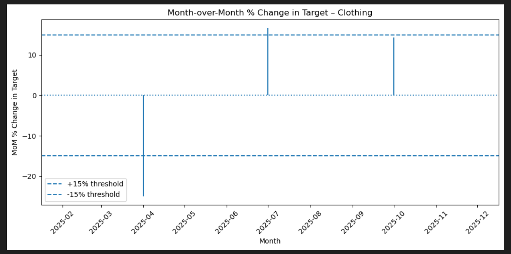
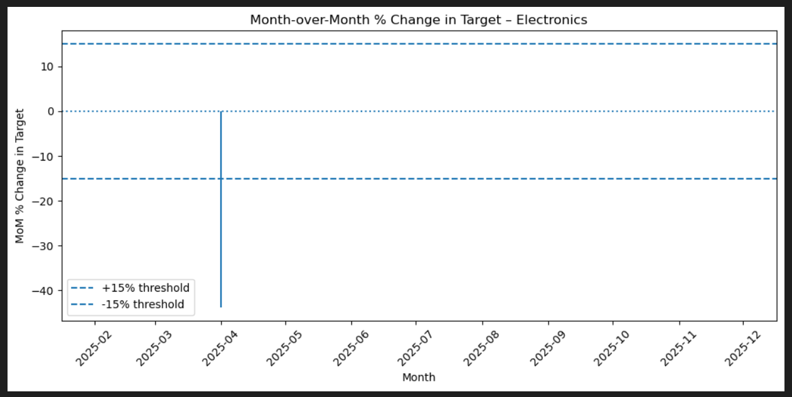
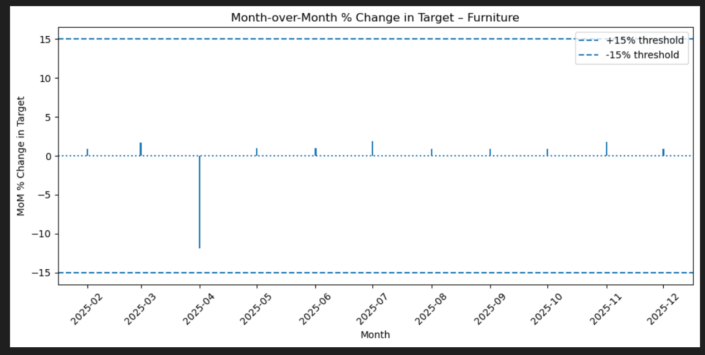
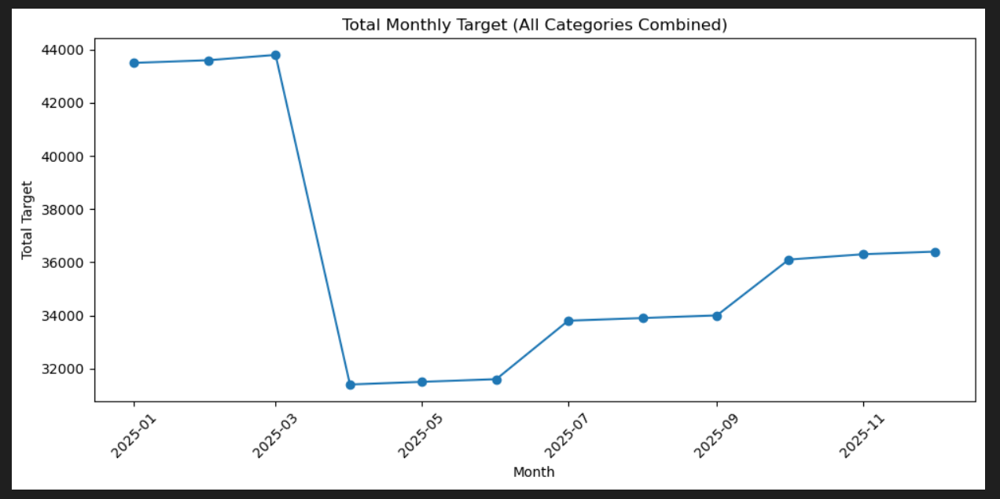
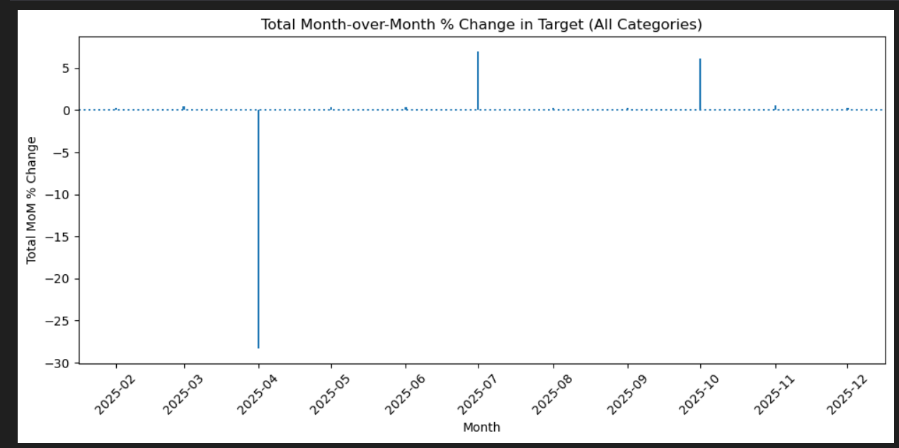
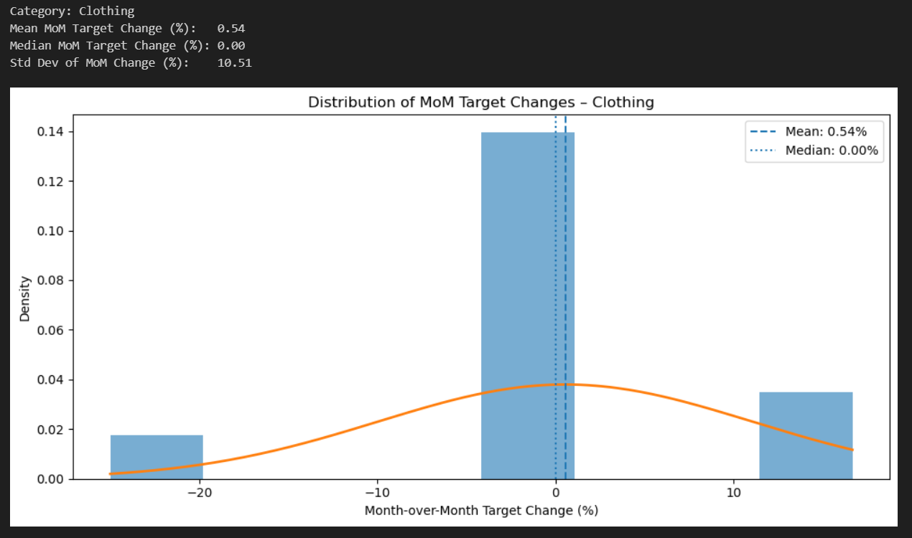
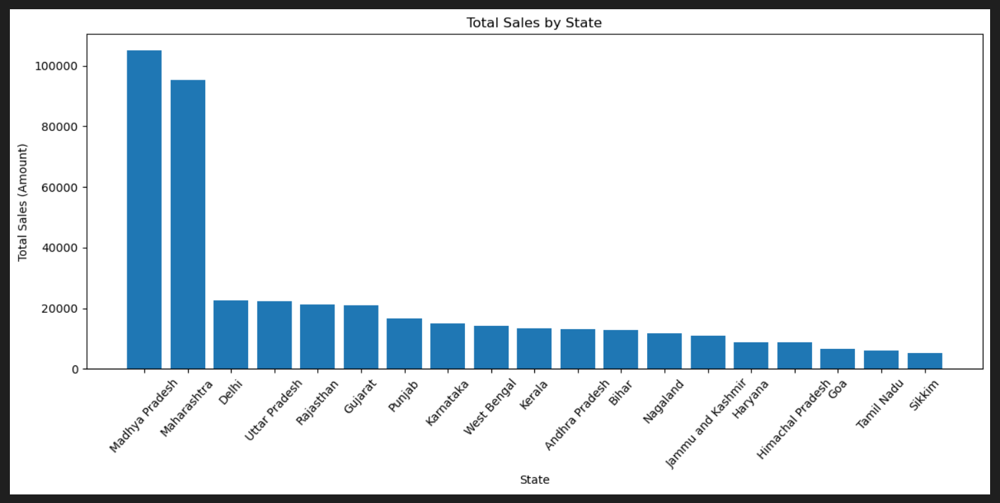
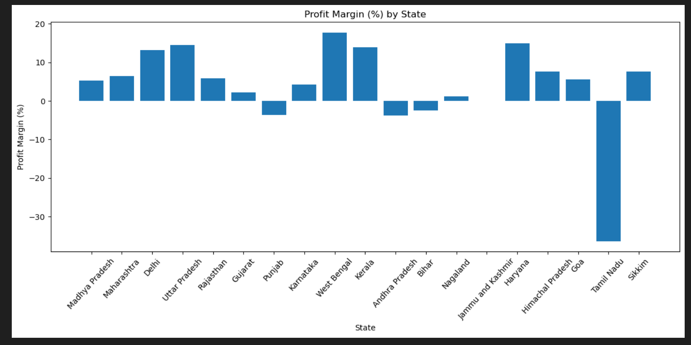

# Sales and Profitability Analysis Project

## Overview

This project provides comprehensive analysis of sales data across three main categories (Clothing, Electronics, and Furniture) to evaluate performance metrics, profitability trends, target achievement, and regional performance insights. The analysis is divided into three main parts: Sales & Profitability Analysis, Target Analysis with Month-over-Month trends, and Regional Performance Insights.

## Project Structure

The analysis uses three main datasets:

* `Sales_target_1.xlsx` \- Sales targets by category and month
* `List_of_Orders_1.xlsx` \- Order information including location data
* `Order_Details_1.xlsx` \- Detailed order information with amounts and profits

## Dependencies

```python
import pandas as pd
import numpy as np
import matplotlib.pyplot as plt
```

## Installation

```bash
pip install pandas numpy matplotlib 
```

## Data Loading

The project begins by loading three Excel datasets into pandas DataFrames:

```python
sales = pd.read_excel(r"Your_File_Path")
orders_list = pd.read_excel(r"Your_File_Path")
order_details = pd.read_excel(r"Your_File_Path")
```

## Analysis Parts

### Part 1: Sales and Profitability Analysis

#### Question 1: Calculate the total sales (Amount) for each category across all orders. 

Calculates total sales for each category by merging order data:
```python
merged_df = pd.merge(
    orders_list,
    order_details,
    on="Order ID",   
    how="inner"      
)

category_sales = (
    merged_df
    .groupby("Category", as_index=False)["Amount"]
    .sum()
    .rename(columns={"Amount": "Total Sales"})
)

print(category_sales)
```

**Key Findings:**

* **Electronics**: ₹165,267 (highest revenue)
* **Clothing**: ₹139,054
* **Furniture**: ₹127,181 (lowest revenue)

#### Question 2: For each category, calculate the average profit per order and total profit margin (profit as a percentage of Amount).

Computes comprehensive profit metrics including:

* Average profit per order
* Total profit margin percentage
* Unique order counts per category

```python
#Group by Category and calculate totals + number of unique orders
category_stats = (
    merged_df
    .groupby("Category")
    .agg(
        Total_Amount=("Amount", "sum"),
        Total_Profit=("Profit", "sum"),
        Unique_Orders=("Order ID", "nunique")  # distinct orders in that category
    )
)

# Calculate

category_stats["Avg_Profit_per_Order"] = (
    category_stats["Total_Profit"] / category_stats["Unique_Orders"]
)

category_stats["Total_Profit_Margin_%"] = (
    category_stats["Total_Profit"] / category_stats["Total_Amount"] * 100
)

print(category_stats)
```

**Key Metrics:**

| Category | Avg Profit/Order | Profit Margin % |
| -------- | ---------------- | --------------- |
| Electronics | ₹51.44 | 6.35% |
| Clothing | ₹28.40 | 8.03% |
| Furniture | ₹12.35 | 1.81% |

#### Question 3: Identify the top-performing and underperforming categories based on
* Total sales (Amount) for each category
* Average profit per order
* Total profit margin percentage

```python
#Calculating category-level metrics
category_stats = (
    merged_df
    .groupby("Category")
    .agg(
        Total_Amount=("Amount", "sum"),
        Total_Profit=("Profit", "sum"),
        Unique_Orders=("Order ID", "nunique")
    )
)

# Avoiding divide-by-zero just in case
category_stats = category_stats[category_stats["Total_Amount"] != 0]

#Adding derived metrics:
# - Average profit per order
# - Total profit margin (%)
category_stats["Avg_Profit_per_Order"] = (
    category_stats["Total_Profit"] / category_stats["Unique_Orders"]
)

category_stats["Total_Profit_Margin_%"] = (
    category_stats["Total_Profit"] / category_stats["Total_Amount"] * 100
)


category_stats = category_stats.reset_index()

print("=== Category Metrics ===")
print(category_stats)

#Identifying top-performing & underperforming categories

# Top / bottom by Total Sales (Amount)
top_sales_cat    = category_stats.loc[category_stats["Total_Amount"].idxmax()]
bottom_sales_cat = category_stats.loc[category_stats["Total_Amount"].idxmin()]

# Top / bottom by Avg Profit per Order
top_avg_profit_cat    = category_stats.loc[category_stats["Avg_Profit_per_Order"].idxmax()]
bottom_avg_profit_cat = category_stats.loc[category_stats["Avg_Profit_per_Order"].idxmin()]

# Top / bottom by Profit Margin
top_margin_cat    = category_stats.loc[category_stats["Total_Profit_Margin_%"].idxmax()]
bottom_margin_cat = category_stats.loc[category_stats["Total_Profit_Margin_%"].idxmin()]

print("\n=== Top / Underperforming Categories ===")

print("\nTop category by TOTAL SALES:")
print(top_sales_cat)

print("\nUnderperforming category by TOTAL SALES:")
print(bottom_sales_cat)

print("\nTop category by AVERAGE PROFIT PER ORDER:")
print(top_avg_profit_cat)

print("\nUnderperforming category by AVERAGE PROFIT PER ORDER:")
print(bottom_avg_profit_cat)

print("\nTop category by PROFIT MARGIN (%):")
print(top_margin_cat)

print("\nUnderperforming category by PROFIT MARGIN (%):")
print(bottom_margin_cat)
```

**Top Performers:**

* **Total Sales**: Electronics (₹165,267)
* **Profit Margin**: Clothing (8.03%)
* **Profit per Order**: Electronics (₹51.44)

**Underperformers:**

* **Furniture** consistently ranks lowest across all metrics

**Category Analysis:**

* **Clothing**: High margin, high volume, steady demand with best profit margin (8.03%)
* **Electronics**: Revenue leader with highest profit per order but competitive pricing pressure
* **Furniture**: Underperformer with extremely thin margins (1.81%) due to high logistics costs

### Part 2: Target Analysis and Trends

#### Question 1: Month-over-Month Target Changes

Analyzes target fluctuations for Furniture category:

```python
furniture_target = sales[sales["Category"] == "Furniture"].copy()

# Sorting by Month so the percent change is calculated in the correct order
furniture_target = furniture_target.sort_values("Month of Order Date")

# Calculating month-over-month % change in target sales
furniture_target["MoM_Target_Change_%"] = (
    furniture_target["Target"].pct_change() * 100
)

print(furniture_target[["Month of Order Date", "Category", "Target", "MoM_Target_Change_%"]])
```


**Key Observations:**

* Furniture targets show relatively stable month-over-month changes
* Largest drop: -11.86% in April 2025
* Generally maintains targets between ₹10,400 - ₹11,800

#### Question 2: Analyzing Data For Significant Target Fluctuations

```python
sales["Month of Order Date"] = pd.to_datetime(sales["Month of Order Date"])

# Work at Year-Month level
sales["Month"] = sales["Month of Order Date"].dt.to_period("M")

# Aggregating in case there are multiple rows per category+month
monthly_cat = (
    sales
    .groupby(["Month", "Category"], as_index=False)["Target"]
    .sum()
)

# Sorting and computing MoM % change in Target for each category
monthly_cat = monthly_cat.sort_values(["Category", "Month"])
monthly_cat["Target_MoM_%"] = (
    monthly_cat
    .groupby("Category")["Target"]
    .pct_change() * 100
)

# Absolute MoM % for easier “significance” checks
monthly_cat["Target_MoM_abs_%"] = monthly_cat["Target_MoM_%"].abs()

# Threshold for “significant” jump/drop (you can tweak this)
threshold = 15  # 15% change or more
monthly_cat["Significant_Change"] = monthly_cat["Target_MoM_abs_%"] > threshold

# Convert Month period to timestamp for plotting
monthly_cat["Month_ts"] = monthly_cat["Month"].dt.to_timestamp()

print("Monthly targets with MoM % change and significant flags:")
print(monthly_cat)
```
**Visualization Features:**

* Monthly target trend lines by category
 
* Month-over-Month percentage change charts




* Total portfolio target analysis

* Statistical distribution analysis with bell curves
 
Identifies months with target changes >15%:

**Significant Changes Detected:**

* **Clothing**: -25% in April, +16.67% in July
* **Electronics**: -43.75% in April (most dramatic change)
* **Furniture**: No changes exceeding 15% threshold


### Part 3: Regional Performance Insights

#### Question 1: Identify the top 5 states with the highest order count. For each of these states, calculate the total sales and average profit. 
```python
# Top 5 states by ORDER COUNT (from List_of_Orders)
state_order_counts = (
    orders_list
    .groupby("State")["Order ID"]
    .nunique()                # distinct orders per state
    .sort_values(ascending=False)
)

top_5_states = state_order_counts.head(5).index.tolist()
print("Top 5 states by order count:")
print(state_order_counts.head(5))

#  Merge orders with order_details to attach Amount & Profit to each order/state
merged = pd.merge(
    orders_list,
    order_details,
    on="Order ID",
    how="inner"
)

# Filter merged data for ONLY those top 5 states
top_states_data = merged[merged["State"].isin(top_5_states)].copy()

# For each of these states, calculate:
#    - total sales (sum of Amount)
#    - average profit (mean of Profit)
state_summary = (
    top_states_data
    .groupby("State")
    .agg(
        Order_Count=("Order ID", "nunique"),
        Total_Sales=("Amount", "sum"),
        Avg_Profit=("Profit", "mean")
    )
    .sort_values("Order_Count", ascending=False)
)

print("\nSummary for top 5 states:")
print(state_summary)

```
**Top 5 States by Order Count:**


1. **Madhya Pradesh**: 101 orders, ₹105,140 sales, ₹16.33 avg profit
2. **Maharashtra**: 90 orders, ₹95,348 sales, ₹21.30 avg profit
3. **Rajasthan**: 32 orders, ₹21,149 sales, ₹16.99 avg profit
4. **Gujarat**: 27 orders, ₹21,058 sales, ₹5.34 avg profit
5. **Punjab**: 25 orders, ₹16,786 sales, -₹10.15 avg profit (loss)

#### Question 2: Highlight any regional disparities in sales or profitability. Suggest regions or cities that should be prioritized for improvement.
```python
merged = pd.merge(
    orders_list,
    order_details,
    on="Order ID",
    how="inner"
)

# Aggregate metrics by State
state_summary = (
    merged
    .groupby("State")
    .agg(
        Total_Sales=("Amount", "sum"),
        Total_Profit=("Profit", "sum"),
        Order_Count=("Order ID", "nunique")
    )
)

# Calculate additional profitability metrics
state_summary["Profit_Margin_%"] = (
    state_summary["Total_Profit"] / state_summary["Total_Sales"] * 100
)

state_summary["Avg_Profit_per_Order"] = (
    state_summary["Total_Profit"] / state_summary["Order_Count"]
)

# Sort states by Total_Sales (for nicer plots)
state_summary = state_summary.sort_values("Total_Sales", ascending=False)

print("State-level sales and profitability summary:")
print(state_summary)

```
```python
# VISUALIZATION 1:
# Bar chart – Total Sales by State

plt.figure(figsize=(12, 6))
plt.bar(state_summary.index, state_summary["Total_Sales"])
plt.title("Total Sales by State")
plt.xlabel("State")
plt.ylabel("Total Sales (Amount)")
plt.xticks(rotation=48)
plt.tight_layout()
plt.show()
```


```python
# VISUALIZATION 2:
# Bar chart – Profit Margin % by State

plt.figure(figsize=(12, 6))
plt.bar(state_summary.index, state_summary["Profit_Margin_%"])
plt.title("Profit Margin (%) by State")
plt.xlabel("State")
plt.ylabel("Profit Margin (%)")
plt.xticks(rotation=48)
plt.tight_layout()
plt.show()
```



**High Performers:**

* **Uttar Pradesh**: 14.48% profit margin, ₹147.14 profit/order
* **West Bengal**: 17.75% profit margin, ₹113.64 profit/order
* **Delhi**: 13.26% profit margin, ₹135.77 profit/order

**Underperformers:**

* **Tamil Nadu**: -36.41% profit margin (significant losses)
* **Punjab**: -3.63% profit margin
* **Andhra Pradesh**: -3.74% profit margin

## Key Business Insights

### Category Performance Summary:

1. **Electronics** drives revenue but faces margin pressure
2. **Clothing** offers best profitability with consistent demand
3. **Furniture** requires strategic review due to poor performance across all metrics

### Target Setting Insights:

* April 2025 shows significant target reductions across categories
* Electronics targets show highest volatility
* Overall target management appears reactive rather than strategic

### Regional Insights:

* Strong performance concentration in Northern and Western states
* Southern states (Tamil Nadu, Andhra Pradesh) show profitability challenges
* Madhya Pradesh and Maharashtra drive volume but need margin optimization


## Usage

1. Update file paths in the data loading section to match your local directory
2. Run each section sequentially for complete analysis
3. Modify category filters and thresholds as needed for specific analysis requirements
4. Use the visualization outputs for presentation and decision-making

## Business Applications

This analysis supports:

* Category portfolio optimization decisions
* Regional expansion and resource allocation strategies
* Target setting and performance management
* Pricing and margin improvement initiatives
* Operational efficiency improvements across categories and regions
